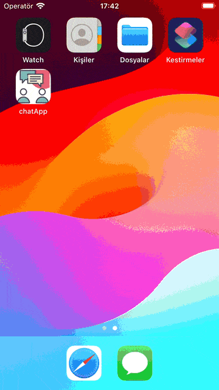

# Chat App

## Description

In this application developed with React Native, a chat application is simulated.

### Registration Process

| Registration Process Preview                  |
| --------------------------------------------- |
|  |

You must register to use the application. Therefore, the application opens with the login page. If you are not registered, there is a link that will take you to the registration page. These connections are made using [Stack Navigation](https://reactnavigation.org/).

Data entry during the registration process and login was made using [Formik](https://www.npmjs.com/package/formik). [Yup](https://www.npmjs.com/package/yup) was used in form validation processes. [Firebase Auth](https://firebase.google.com/) was used for registration and login processes.

When the application is logged in, a notification is sent to the user using [React Native Flash Message](https://www.npmjs.com/package/react-native-flash-message). User login information was also saved on the [Firebase](https://firebase.google.com/). Thus, the user is automatically logged in every time the application is opened.

### Messaging Process and Logout Process

| Message Preview                         | Message Preview                         |
| --------------------------------------- | --------------------------------------- |
| Iphone SE                               | Iphone 15                               |
|  |  |

When the application is opened, we are greeted by the [Tab Navigation](https://reactnavigation.org/) structure. The first page that opens is the page containing all general messages. This page is similar to X (formerly Twitter). Anyone registered with the application can send messages to this section. All users can view this message simultaneously. A custom FlatList is used on this page.

From the Groups tab in [Tab Navigation](https://reactnavigation.org/), a group can be created by selecting one or more people and group messages can be viewed.

From the Private tab in [Tab Navigation](https://reactnavigation.org/), messaging can be started with the selected person and the initiated messages can be viewed.

In the Profile tab located in [Tab Navigation](https://reactnavigation.org/), [Drawer Navigation](https://reactnavigation.org/) is also used on the page. User information can be accessed from this page. Additionally, exiting from Drawer Navigation can be performed.

### Other

While data is being pulled from the API and an error is encountered, Loading and Error animations are shown using [Lottie React Native](https://www.npmjs.com/package/lottie-react-native).

Many packages and libraries have been used in this application. Please review the "Used Technologies" heading.

> **Note**: This application uses [Firebase](https://firebase.google.com/) as its database. If you encounter an Error animation when you install the application, you will probably need to re-do the Firebase integration.

## Used Technologies

- [Axios](https://www.npmjs.com/package/axios)
- [Date-Fns](https://www.npmjs.com/package/date-fns)
- [Firebase (App - Auth - Database - Storage)](https://firebase.google.com/)
- [Formik](https://www.npmjs.com/package/formik)
- [Lottie React Native](https://www.npmjs.com/package/lottie-react-native)
- [React Context](https://react.dev/learn/passing-data-deeply-with-context)
- [React Native](https://reactnative.dev/)
- [React Native Auto Scrool Flatlist](https://www.npmjs.com/package/react-native-autoscroll-flatlist)
- [React Native Date Picker](https://www.npmjs.com/package/react-native-date-picker)
- [React Native Flash Message](https://www.npmjs.com/package/react-native-flash-message)
- [React Native Image Picker](https://www.npmjs.com/package/react-native-image-picker)
- [React Native Keyboard Aware Scrool View](https://www.npmjs.com/package/react-native-keyboard-aware-scroll-view)
- [React Native Modal](https://www.npmjs.com/package/react-native-modal)
- [React Native Paper](https://www.npmjs.com/package/react-native-paper)
- [React Native Paper Dates](https://www.npmjs.com/package/react-paper-dates)
- [React Native Progress](https://www.npmjs.com/package/react-progress)
- [React Native Svg](https://www.npmjs.com/package/react-native-svg)
- [React Native Vector Icons](https://www.npmjs.com/package/react-native-vector-icons)
- [React Navigation (Native, Native Stack, Drawer and Bottom-Tabs)](https://reactnavigation.org/)
- [Yup](https://www.npmjs.com/package/yup)

## Getting Started

> **Note**: Make sure you have completed the [React Native - Environment Setup](https://reactnative.dev/docs/environment-setup) instructions till "Creating a new application" step, before proceeding.

### Step 1: Start the Metro Server

First, you will need to start **Metro**, the JavaScript _bundler_ that ships _with_ React Native.

To start Metro, run the following command from the _root_ of your React Native project:

```bash
# using npm
npm start

# OR using Yarn
yarn start
```

### Step 2: Start your Application

Let Metro Bundler run in its _own_ terminal. Open a _new_ terminal from the _root_ of your React Native project. Run the following command to start your _Android_ or _iOS_ app:

#### For Android

```bash
# using npm
npm run android

# OR using Yarn
yarn android
```

#### For iOS

```bash
# using npm
npm run ios

# OR using Yarn
yarn ios
```

If everything is set up _correctly_, you should see your new app running in your _Android Emulator_ or _iOS Simulator_ shortly provided you have set up your emulator/simulator correctly.

This is one way to run your app — you can also run it directly from within Android Studio and Xcode respectively.

## Congratulations! :tada:

You have successfully run. :partying_face:

## License

This project is licensed under the MIT License - see the [LICENSE](LICENSE) file for details.
