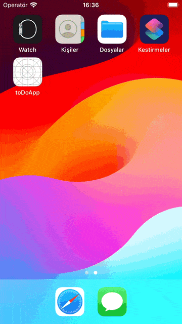

# Code Work App

## Description

In this application developed with React Native, a job posting application is simulated.

You must register to use the application. Therefore, the application opens with the login page. If you are not registered, there is a link that will take you to the registration page. These connections are made using [Stack Navigation](https://reactnavigation.org/).

Data entry during the registration process and login was made using [Formik](https://www.npmjs.com/package/formik). [Yup](https://www.npmjs.com/package/yup) was used in form validation processes. [Firebase Auth](https://firebase.google.com/) was used for registration and login processes.

When the application is logged in, a notification is sent to the user using [React Native Flash Message](https://www.npmjs.com/package/react-native-flash-message). User information was also saved on the device using [React Native Async Storage](https://www.npmjs.com/package/@react-native-async-storage/async-storage). Thus, the user is automatically logged in every time the application is opened.

After this, a [Drawer Navigation](https://reactnavigation.org/) structure greets us in the application. The first page that opens is the page containing all job postings. FlatList is used on this page and the first part of the data taken from [The Muse API](https://www.themuse.com/developers/api/v2) is shown. There are buttons at the bottom of the page that will direct you to pages containing other advertisements. When these buttons are clicked, other data is taken from the API and shown to the user. When the user clicks on these advertisements, the user is directed to the advertisement page. On this page, the user can apply to the job posting or favorite the posting. When the user applies to a job posting or favorites a job posting, that job posting is added to the relevant pages in Drawer Navigation. Additionally, there is a sign on the home page indicating that an application has been made to that job posting or that the job posting has been added to favorites. By entering the job posting, the user can withdraw his application and remove the job posting from his favorites. Since all of these transactions are recorded, the relevant transactions are not lost when the application is closed and opened.

While data is being pulled from the API and an error is encountered, Loading and Error animations are shown using [Lottie React Native](https://www.npmjs.com/package/lottie-react-native).

Finally, user information can be accessed and the logout process can be configured from the Profile page in Drawer Navigation.

> **Note**: This application uses [Firebase](https://firebase.google.com/) as its database. If you encounter an Error animation when you install the application, you will probably need to re-do the Firebase integration.

## Preview



### Used Technologies

- [Lottie React Native](https://www.npmjs.com/package/lottie-react-native)
- [React Native](https://reactnative.dev/)
- [React Native Async Storage](https://www.npmjs.com/package/@react-native-async-storage/async-storage)

## Getting Started

> **Note**: Make sure you have completed the [React Native - Environment Setup](https://reactnative.dev/docs/environment-setup) instructions till "Creating a new application" step, before proceeding.

### Step 1: Start the Metro Server

First, you will need to start **Metro**, the JavaScript _bundler_ that ships _with_ React Native.

To start Metro, run the following command from the _root_ of your React Native project:

```bash
# using npm
npm start

# OR using Yarn
yarn start
```

### Step 2: Start your Application

Let Metro Bundler run in its _own_ terminal. Open a _new_ terminal from the _root_ of your React Native project. Run the following command to start your _Android_ or _iOS_ app:

#### For Android

```bash
# using npm
npm run android

# OR using Yarn
yarn android
```

#### For iOS

```bash
# using npm
npm run ios

# OR using Yarn
yarn ios
```

If everything is set up _correctly_, you should see your new app running in your _Android Emulator_ or _iOS Simulator_ shortly provided you have set up your emulator/simulator correctly.

This is one way to run your app — you can also run it directly from within Android Studio and Xcode respectively.

## Congratulations! :tada:

You have successfully run. :partying_face:

## License

This project is licensed under the MIT License - see the [LICENSE](LICENSE) file for details.
